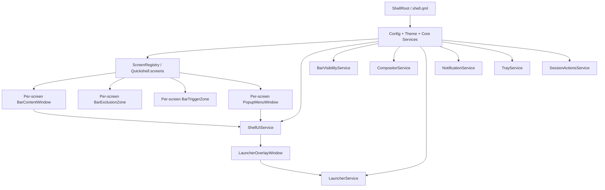
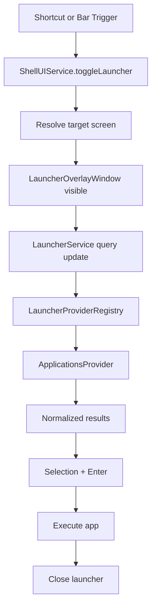

# Quickshell Desktop Environment Design (v2 — Implementation-Verified)

> **Status**: Iterations 0-5 complete, Iteration 6 in progress
> **Source PRD**: `docs/Quickshell-Desktop-PRD.md`
> **Scope**: MVP design for the system bar, system tray, notification indicator, auto-hide trigger, session menu, and overlay application launcher.

---

## 1) Design Summary

This document translates the PRD into an implementable architecture for the first Quickshell shell release.

The MVP is intentionally narrow:

- one **top bar** per enabled monitor,
- one **overlay launcher** on the active screen,
- **system tray** support,
- **notification presence** in the bar,
- **auto-hide trigger zones**,
- and a **minimal power/session menu** in the bar.

The design optimizes for three things:

- **stable surface lifecycle**,
- **compositor-agnostic architecture**,
- and **clear ownership of UI state**.

### Why

The reference shells in `external` show that Quickshell is powerful, but complexity grows quickly when window types, focus rules, and compositor-specific behavior are mixed together.

### How

The MVP will:

- split shell responsibilities into a small number of dedicated surfaces,
- instantiate screen-bound surfaces per monitor,
- route compositor-specific behavior through a normalized adapter layer,
- keep popup and overlay coordination centralized,
- and expose future extension points without implementing the full ecosystem yet.

---

## 2) Resolved Design Decisions

These decisions are already fixed by the PRD and follow-up clarifications.

- **Tray in MVP**: included in the first release.
- **Notification widget in MVP**: included as a bar presence indicator, not a full notification center.
- **Auto-hide trigger in MVP**: included in the first release.
- **Session menu in MVP**: included as a minimal power/session actions menu in the bar.
- **Compositor strategy**: compositor-agnostic first; compositor-specific logic must live behind adapters.
- **Monitor layout policy**: the bar widget order stays the same across all monitors.
- **Launcher strategy**: overlay launcher only in the MVP.
- **Launcher evolution path**: future expansion should favor plugin-based productivity providers.

---

## 3) Design Goals

### Primary Goals

- Make the shell reliable enough for daily use.
- Keep the architecture small enough to understand and debug.
- Preserve a clean path for future modules.
- Avoid direct coupling between UI widgets and compositor-specific APIs.

### Design Constraints

- Target **Linux Wayland**.
- Support multi-monitor setups from the start.
- Keep the number of shell surfaces low.
- Prefer persistent surfaces over repeated create/destroy cycles.
- Make focus behavior explicit for every window.

### Non-Goals in This Design

- Notification history panel.
- Dock or task view.
- Lock screen.
- Wallpaper management.
- Desktop widgets.
- Per-monitor bar customization.
- Full launcher provider ecosystem.

---

## 4) Architecture Overview

At a high level, the shell will be composed from a root `shell.qml`, a set of singleton services, and a per-screen orchestration layer.



### Why

A split architecture keeps the bar, exclusion behavior, auto-hide reveal behavior, popup staging, and launcher lifecycle independent.

### How

Instead of one large all-purpose window, the shell uses a small set of focused surfaces with clear responsibilities.

---

## 5) Window Topology

The MVP should use the following window model.

| Surface | Count | Layer | Keyboard Focus | Exclusion | Responsibility |
|---|---:|---|---|---|---|
| `BarContentWindow` | per enabled screen | `Top` | `None` | `Auto` | Renders the visible bar UI and reserves compositor space |
| `BarTriggerZone` | per enabled screen when needed | `Top` | `None` | `Ignore` | Thin invisible edge strip for auto-hide reveal |
| `PopupMenuWindow` | per enabled screen | `Top` by default | `None` or `OnDemand` | `Ignore` | Hosts tray menus, session menu, and future small popups |
| `LauncherOverlayWindow` | active on one screen | `Overlay` | `Exclusive` or adapter-managed | `Ignore` | Full-screen overlay launcher and dimmer |

### Implementation Finding: ExclusionMode

`BarContentWindow` uses `ExclusionMode.Auto` with a dynamic `exclusiveZone`. When the bar is visible and exclusive, `exclusiveZone` equals `context.barHeight`, reserving compositor space. When the bar is hidden (auto-hide) or non-exclusive, `exclusiveZone` is set to `0`, releasing the space.

A dedicated `BarExclusionZone` surface was initially implemented to separate space reservation from the visible bar, but was removed because:
- With `ExclusionMode.Ignore`, `BarContentWindow` rendered at y=0 ignoring all exclusive zones, causing it to overlap other layer-shell surfaces (e.g. a live shell's bar during testing).
- With `ExclusionMode.Normal` + `exclusiveZone: 0`, it would be pushed below ALL exclusive zones (including its own), positioning it incorrectly.
- The split added complexity without MVP benefit — auto-hide transitions without animations don't need a persistent exclusion surface.

Key distinction:
- **`implicitHeight`** — the QML window's pixel height on screen (visual sizing)
- **`exclusiveZone`** — a Wayland layer-shell protocol value telling the compositor how many pixels to reserve at the anchor edge for normal application windows (layout reservation)
- **`ExclusionMode.Auto`** — automatically sets `exclusiveZone` equal to `implicitHeight` (overridden by explicit `exclusiveZone` binding)
- **`ExclusionMode.Ignore`** — sets `exclusiveZone` to -1, meaning the surface does not reserve any space AND does not respect other exclusive zones

These are independent: a surface can be 32px tall (`implicitHeight`) with `exclusiveZone: 0` (apps overlap it) or `exclusiveZone: 32` (apps are pushed below it).

### Implementation Finding: Multi-Instance Stacking

The Wayland layer-shell protocol does not allow two independent shell clients to control their relative z-order within the same layer. Two `Top`-layer bars from different Quickshell instances will overlap unpredictably. The recommended dev workflow is to kill the live shell before testing — see `docs/DEV-WORKFLOW.md`.

### Why split the bar into multiple surfaces?

A single bar window is simpler on paper, but the split model is safer in practice.

- `BarTriggerZone` can remain extremely lightweight and only active when needed.
- `PopupMenuWindow` can own click-outside behavior for tray and session menus without forcing the bar itself to manage complex popup rules.
- Space reservation is handled directly by `BarContentWindow` via `exclusiveZone`, which simplifies the surface stack while still supporting auto-hide (set `exclusiveZone: 0` when hidden).

### Monitor Stack

```text
Per enabled screen:

┌──────────────────────────────────────────────┐
│ BarContentWindow   (Top, visible bar + reserve)│
│ BarTriggerZone     (Top, 1px reveal strip)   │
│ PopupMenuWindow    (Top, fullscreen popup)   │
└──────────────────────────────────────────────┘

Global screen-targeted:

┌──────────────────────────────────────────────┐
│ LauncherOverlayWindow (Overlay, one screen)  │
└──────────────────────────────────────────────┘
```

---

## 6) Root Composition

The shell composition root should stay small.

### Current root shape (implemented)

```qml
// shell.qml
ShellRoot {
    id: root

    ScreenShells {}
}
```

### Proposed root responsibilities

- initialize configuration and theme singletons,
- initialize normalized services,
- enumerate enabled screens,
- create screen-aware shell surfaces,
- load the launcher overlay infrastructure,
- and avoid embedding business logic directly in `shell.qml`.

### Design Rule

`shell.qml` should compose modules, not own their detailed behavior.

---

## 7) File and Module Structure

The project should start from a structure that is small but future-safe.

```text
docs/
  Quickshell-Desktop-PRD.md
  Quickshell-Desktop-DESIGN.md
  Quickshell-Desktop-DESIGN-v2.md          ← this document
  DEV-WORKFLOW.md
  plans/
    2026-04-12-quickshell-desktop-implementation-plan.md

shell.qml

config/
  qmldir
  ShellConfig.qml                          ✅ implemented
  Defaults.qml                             ✅ implemented
  PersistentConfig.qml                     ✅ implemented
  Theme.qml                                ✅ implemented

types/
  qmldir
  ScreenContext.qml                        ✅ implemented
  LauncherResult.qml
  WorkspaceState.qml
  WindowState.qml

modules/
  screens/
    qmldir
    ScreenShells.qml                       ✅ implemented
    ScreenShellDelegate.qml                ✅ implemented

  bar/
    qmldir
    BarContentWindow.qml                   ✅ implemented
    BarView.qml                            ✅ implemented
    BarLayout.qml                          ✅ implemented
    BarTriggerZone.qml                     ✅ implemented
    widgets/
      LauncherButton.qml
      WorkspacesWidget.qml
      ActiveWindowWidget.qml
      ClockWidget.qml
      NetworkWidget.qml
      VolumeWidget.qml
      BatteryWidget.qml
      NotificationIndicatorWidget.qml
      TrayWidget.qml
      SessionMenuButton.qml

  popups/
    PopupMenuWindow.qml
    TrayMenu.qml
    SessionMenu.qml
    ConfirmActionDialog.qml

  launcher/
    LauncherOverlayWindow.qml
    LauncherView.qml
    LauncherResultsList.qml
    LauncherSearchField.qml

components/
  qmldir
  containers/
    qmldir
    ShellWindow.qml                        ✅ implemented
  common/
    IconLabel.qml
    HoverArea.qml
    SelectionList.qml

services/
  qmldir
  ui/
    qmldir
    ScreenRegistryService.qml              ✅ implemented
    ShellUIService.qml
    BarVisibilityService.qml

  compositor/
    CompositorService.qml
    backends/
      HyprlandBackend.qml
      GenericBackend.qml

  launcher/
    LauncherService.qml
    LauncherProviderRegistry.qml
    providers/
      ApplicationsProvider.qml

  system/
    TrayService.qml
    NotificationService.qml
    SessionActionsService.qml
    AudioService.qml
    NetworkService.qml
    PowerService.qml
```

### Import Strategy

Cross-directory imports use **relative path imports** in Quickshell's VFS:

```qml
import "../../config"     // from services/ui to config
import "../../types"      // from services/ui to types
import "../bar"           // from modules/screens to modules/bar
import "../../components/containers"  // from modules/bar to components
```

This pattern is required because Quickshell's VFS does not resolve module-style imports (e.g. `import qs.Config`) for user-defined modules the way some reference shells configure it. The `qmldir` files are still necessary for the QML language server and for registering singletons.

### Why

This layout separates:

- UI modules,
- stateful services,
- normalized types,
- and backend-specific integrations.

### How

The rule should be:

- UI modules depend on services and types,
- services may depend on backends,
- backends may depend on compositor-specific APIs,
- but UI modules should not depend directly on compositor-specific imports.

---

## 8) Screen Context Model

Every screen-aware module should receive an explicit `ScreenContext` object instead of passing raw `ShellScreen` values throughout the tree.

### Implementation Finding: ShellScreen API

`ShellScreen` (type name `QuickshellScreenInfo`) exposes:

| Property | Type | Notes |
|---|---|---|
| `name` | `QString` | Constant |
| `model` | `QString` | Constant |
| `serialNumber` | `QString` | Constant |
| `x` | `int` | Read-only, reactive |
| `y` | `int` | Read-only, reactive |
| `width` | `int` | Read-only, reactive |
| `height` | `int` | Read-only, reactive |
| `physicalPixelDensity` | `double` | Read-only, reactive |
| `logicalPixelDensity` | `double` | Read-only, reactive |
| `devicePixelRatio` | `double` | Read-only, reactive |
| `orientation` | `Qt::ScreenOrientation` | Read-only, reactive |
| `primaryOrientation` | `Qt::ScreenOrientation` | Read-only, reactive |

**Not available**: `.geometry`, `.scale`, `.primary`. The original design doc listed these but they do not exist on the type.

### Current ScreenContext shape (implemented)

```qml
// types/ScreenContext.qml
QtObject {
    id: context

    required property ShellScreen screen

    readonly property string name: screen.name
    readonly property bool isPrimary: ShellConfig.primaryScreen === "" || ShellConfig.primaryScreen === screen.name

    readonly property string barEdge: ShellConfig.barEdge
    readonly property int barHeight: ShellConfig.barHeight
}
```

### Why `isPrimary` is config-derived

`ShellScreen` has no `.primary` property. The compositor does not expose which monitor is "primary" in the X11/Wayland sense. Instead, `ShellConfig.primaryScreen` holds a screen name string:

- Empty string → all screens treated as primary (sensible default for single-monitor)
- Set to a screen name (e.g. `"DP-1"`) → only that screen is primary

### Context creation pattern

`ScreenContext` instances are created by `ScreenRegistryService.createContext()` using `Component.createObject` with an `as ScreenContext` cast. The context is then passed to `ScreenShellDelegate` as a `required property ScreenContext context`.

### Usage Rule

Any per-screen surface or widget should accept:

- `required property ScreenContext context`

That keeps modules consistent with the architecture direction.

---

## 9) Service Responsibilities

## 9.0 Configuration Persistence ✅

### Why

Configuration should survive Quickshell restarts, not just hot-reloads. Without persistence, user changes to `primaryScreen`, `barHeight`, `excludedScreens`, etc. are lost every time the shell process restarts.

### How

Use Quickshell's `FileView` + `JsonAdapter` to bind configuration properties to a JSON file on disk:

- `PersistentConfig.qml` — a `FileView` singleton that reads/writes `config.json` from `Quickshell.shellDir`
- `JsonAdapter` declares each configurable property with defaults from `Defaults.qml`
- `ShellConfig.qml` reads from `PersistentConfig.adapter.*` instead of directly from `Defaults`
- `Defaults.qml` remains the source of hardcoded default values (fallback when no persisted value exists)
- On first run, `onLoadFailed` writes defaults to disk so the file always exists after launch

### Config Layering

```text
Defaults.qml (hardcoded defaults)
    ↓
PersistentConfig.qml (disk-persisted overrides via FileView + JsonAdapter)
    ↓
ShellConfig.qml (read-only facade consumed by the rest of the shell)
```

### Persistence vs Reload

- **`PersistentProperties`** — survives hot-reload within the same process, but NOT across restarts. Appropriate for transient UI state (popup open/closed).
- **`FileView` + `JsonAdapter`** — disk-persistent, survives full process restart. Appropriate for user configuration that must survive restarts.

### Current implementation

```qml
// config/PersistentConfig.qml
pragma Singleton

FileView {
    path: Quickshell.shellDir + "/config.json"
    watchChanges: true
    onFileChanged: reload()

    JsonAdapter {
        property string primaryScreen: Defaults.primaryScreen
        property int barHeight: Defaults.barHeight
        property string barEdge: Defaults.barEdge
        property string barDisplayMode: Defaults.barDisplayMode
        property int triggerZoneHeight: Defaults.triggerZoneHeight
        property int launcherWidth: Defaults.launcherWidth
        property int launcherMaxResults: Defaults.launcherMaxResults
        property int popupEdgeMargin: Defaults.popupEdgeMargin
        property var excludedScreens: []
    }

    onAdapterUpdated: writeAdapter()
    onLoadFailed: writeAdapter()
    Component.onCompleted: reload()
}
```

---

## 9.1 `ScreenRegistryService` ✅

### Why

The shell needs one place to decide which screens are active and to create stable `ScreenContext` objects.

### How

Responsibilities:

- wrap `Quickshell.screens`,
- filter excluded screens,
- create one `ScreenContext` per enabled screen,
- provide lookup by screen name,
- react to monitor hotplug and screen removal.

### Current implementation

```qml
// services/ui/ScreenRegistryService.qml
pragma Singleton

Singleton {
    id: registry

    readonly property list<ShellScreen> enabledScreens: {
        const excluded = ShellConfig.excludedScreens;
        if (excluded.length === 0)
            return Quickshell.screens;
        return Quickshell.screens.filter(s => !isExcluded(s.name));
    }

    function isExcluded(screenName: string): bool { ... }
    function screenByName(screenName: string): var { ... }
    function createContext(screen: ShellScreen): ScreenContext { ... }
}
```

---

## 9.2 `ShellUIService`

### Why

Open/close behavior for overlays and popup surfaces becomes fragile if spread across widgets.

### How

Responsibilities:

- maintain the one-open-popup invariant,
- maintain launcher open state,
- resolve the target screen for launcher opening,
- register `PopupMenuWindow` instances by screen,
- close popups when overlays or screen changes require it,
- expose methods like:
  - `toggleLauncher(screen?)`
  - `closeLauncher()`
  - `openTrayMenu(screen, anchor, menu)`
  - `openSessionMenu(screen, anchor)`
  - `closeActivePopup(screen?)`

---

## 9.3 `BarVisibilityService`

### Why

Auto-hide behavior is stateful and screen-specific. It should not live inside individual widgets.

### How

Responsibilities:

- track per-screen bar visibility,
- track whether a screen trigger zone is hovered,
- track whether a popup is open on a screen,
- own show/hide delay timers,
- keep the bar visible while the user interacts with the bar or its popup,
- expose `effectiveVisible(screenName)`.

Suggested per-screen state:

- `displayMode`: `visible | auto_hide | non_exclusive`
- `hovered`
- `popupOpen`
- `forceVisible`
- `effectiveVisible`

---

## 9.4 `CompositorService`

### Why

Workspace state, active window metadata, focused screen, and fullscreen detection are compositor-sensitive.

### How

Responsibilities:

- provide a normalized interface for UI consumers,
- choose an adapter backend,
- isolate imports like `Quickshell.Hyprland` inside backend files only,
- degrade gracefully when a backend lacks a feature.

Normalized interface should expose at least:

- `focusedScreenName`
- `workspacesForScreen(screenName)`
- `activeWindowForScreen(screenName)`
- `screenHasFullscreen(screenName)`
- `switchWorkspace(screenName, workspaceId)`

### Backend Strategy

Start with:

- `HyprlandBackend.qml`
- `GenericBackend.qml`

`GenericBackend` may initially support only a reduced feature set, but the UI contract remains stable.

---

## 9.5 `TrayService`

### Why

The tray widget needs a stable facade over `Quickshell.Services.SystemTray` and popup behavior.

### How

Responsibilities:

- expose normalized tray items,
- support filtering hidden/passive items if configured,
- integrate with `ShellUIService` for tray menu opening,
- keep tray behavior independent from bar layout code.

The service may remain thin in the MVP, but it should still be the single bar-facing integration point.

---

## 9.6 `NotificationService`

### Why

The PRD includes a notification widget in the MVP, but not a full notification center.

### How

Responsibilities:

- observe incoming notifications,
- track unread presence and optional unread count,
- expose a minimal state model to the bar,
- preserve a store that can later power toasts or notification history.

### MVP Rule

The MVP widget only needs:

- unread presence,
- optional unread count,
- tooltip-friendly summary text,
- and a future-safe interface.

It does **not** need to implement a notification history panel in the first release.

---

## 9.7 `SessionActionsService`

### Why

Power and session commands are operationally sensitive and should not be embedded directly in the bar widget.

### How

Responsibilities:

- expose safe session actions:
  - lock
  - logout
  - reboot
  - shutdown
- read commands from config,
- support confirmation for destructive actions,
- centralize execution and failure logging.

### MVP Safety Rule

- `lock` may execute immediately.
- `logout`, `reboot`, and `shutdown` should require confirmation.

---

## 9.8 `LauncherService`

### Why

The launcher needs a state owner for query text, result calculation, selection state, and launch behavior.

### How

Responsibilities:

- own launcher query state,
- debounce search,
- ask the provider registry for results,
- manage selection index,
- execute selected results,
- request launcher close after successful launch.

---

## 9.9 `LauncherProviderRegistry`

### Why

The MVP only ships with application search, but the design must preserve a clean extension path for productivity providers.

### How

Responsibilities:

- register available providers,
- query active providers in priority order,
- merge and normalize results,
- keep the launcher UI independent from specific provider implementations.

### MVP Policy

Only `ApplicationsProvider` ships initially, but the registry exists in the MVP design.

---

## 10) Bar Design

The bar should have a fixed three-zone layout that stays the same on every monitor.

### Proposed Layout

- **Left**
  - launcher button
  - workspaces
  - active window title

- **Center**
  - clock/date

- **Right**
  - network
  - volume
  - battery
  - notification indicator
  - system tray
  - session menu button

### Current implementation (placeholders)

`BarLayout.qml` renders the three-zone `RowLayout` with placeholder `Text` items in each zone. All widget slots are present in the correct order but display static labels. Real widgets will replace these in Iteration 3.

### Why

A fixed layout reduces configuration complexity, avoids per-monitor drift, and keeps the MVP easy to reason about.

### How

- Widget ordering must be deterministic.
- If a widget has no useful data on a device, it can hide or collapse gracefully.
- Layout policy remains uniform across monitors even when content differs.

### Widget Notes

- **Notification indicator**: presence-only in the MVP.
- **Tray widget**: opens menu content inside `PopupMenuWindow`.
- **Session menu button**: opens a compact popup for session actions.

---

## 11) Popup and Menu Architecture

`PopupMenuWindow` should be the shared popup stage for tray and session actions.

### Why

This avoids embedding popup complexity inside the bar surface and makes outside-click behavior consistent.

### How

Each screen gets one `PopupMenuWindow`.

Responsibilities:

- render tray menu content,
- render session menu content,
- own click-outside dismissal,
- close on request from `ShellUIService`,
- support future small popups without changing the bar architecture.

### Design Rules

- Only one popup may be open per screen at a time.
- Opening a popup on one screen closes other popups if needed.
- Popup content must not manage global shell state directly.
- Any compositor-specific popup-layer workaround belongs in `CompositorService` or an adapter, not in bar widgets.

---

## 12) Auto-Hide Design

The MVP includes auto-hide reveal support, but the architecture should keep it minimal.

### Why

Auto-hide is useful, but it can become fragile if animation, visibility, exclusion, and hover behavior are coupled together.

### How

The design should separate concerns:

- `BarVisibilityService` owns visibility state,
- `BarTriggerZone` only reports edge hover,
- `BarContentWindow` only renders based on state,
- `BarExclusionZone` decides whether compositor space should be reserved.

### Trigger Behavior

- `BarTriggerZone` is a thin invisible strip on the bar edge.
- It is active only when auto-hide mode is enabled and the bar is effectively hidden.
- Hovering it requests reveal through `BarVisibilityService`.

### Exclusion Behavior

- When auto-hide is active, the exclusion zone should ignore exclusive reservation.
- When the bar is persistently visible and exclusive, the exclusion zone should reserve space.

### Safety Rule

Auto-hide must not require special fullscreen hacks. The bar should remain compositor-safe even if fullscreen windows naturally occlude top-layer content.

---

## 13) Launcher Design

The launcher is overlay-only in the MVP.

### Why

Overlay mode is simpler than supporting both bar-attached and overlay modes. It also avoids geometry coupling between bar layout and launcher placement.

### How

Each screen may have a `LauncherOverlayWindow` instance, but only the active screen instance should be visible.

Responsibilities:

- dim the background,
- host the launcher panel,
- capture keyboard focus while open,
- close on explicit dismissal,
- hand search state to `LauncherService`.

### MVP Presentation

- centered panel
- dimmed backdrop
- search field
- result list
- default selected result

### Search Flow



---

## 14) Launcher Provider Interface

The future provider system should be designed now, even if only one provider ships initially.

### Why

This avoids rewriting launcher internals when productivity providers are added later.

### How

Each provider should expose a normalized contract such as:

- `id`
- `label`
- `enabled`
- `priority`
- `supportsQuery(query)`
- `search(query, limit)`
- `activate(result)`

Each result should normalize to a `LauncherResult` type:

- `id`
- `providerId`
- `title`
- `subtitle`
- `icon`
- `kind`
- `actions`
- `payload`

### MVP Provider

`ApplicationsProvider` should:

- read desktop entries,
- deduplicate results where needed,
- search by name, comment, and executable name,
- return icon + label presentation data,
- and support direct execution.

### Deferred Providers

Later providers may include:

- calculator,
- clipboard,
- emoji,
- commands,
- web search,
- or project-specific productivity plugins.

---

## 15) Compositor Abstraction Boundaries

Compositor-specific logic must be isolated from UI modules.

### Rule

UI files under `modules/` should not directly import compositor-specific namespaces when a normalized service can provide the same information.

### Allowed Backend Dependency Area

Only backend files under `services/compositor/backends/` should directly depend on compositor-specific APIs.

### Examples

- `WorkspacesWidget.qml` reads from `CompositorService`, not `Hyprland` directly.
- `ActiveWindowWidget.qml` reads normalized active-window state.
- `BarContentWindow.qml` uses `CompositorService.screenHasFullscreen(screenName)`.
- `ShellUIService` asks `CompositorService` to resolve the most relevant active screen.

### Benefit

This keeps the MVP implementable on Hyprland first if needed, while preserving a clean path to additional compositor backends.

---

## 16) Data Flow and Ownership

### Boot Flow

1. `shell.qml` loads config and services.
2. `ScreenRegistryService` produces enabled `ScreenContext` instances.
3. `ScreenShells.qml` creates per-screen bar, exclusion, trigger, and popup windows.
4. `ShellUIService` registers per-screen popup windows.
5. `LauncherOverlayWindow` remains dormant until requested.

### Tray Flow

1. User clicks a tray item.
2. `TrayWidget` delegates to `TrayService` and `ShellUIService`.
3. `ShellUIService` resolves the screen's `PopupMenuWindow`.
4. `PopupMenuWindow` renders the tray menu.
5. Click outside closes the popup.

### Session Menu Flow

1. User clicks the session menu button.
2. `ShellUIService` opens `SessionMenu` inside the screen popup window.
3. Selecting a destructive action opens confirmation.
4. `SessionActionsService` executes the confirmed command.

### Notification Flow

1. `NotificationService` observes incoming notifications.
2. Service updates unread presence/count state.
3. `NotificationIndicatorWidget` updates in the bar.
4. Future notification history or toasts can reuse the same store.

---

## 17) Error Handling and Fallbacks

### Compositor Backend Missing Features

If a compositor backend cannot provide workspaces or active window metadata:

- the bar still renders,
- affected widgets degrade gracefully,
- and the shell continues operating.

### Desktop Entries Unavailable

If application lookup fails:

- the launcher opens,
- shows an empty or error state,
- and does not crash the shell.

### Tray Unavailable

If system tray integration is not available:

- the tray widget hides or shows an empty state,
- and the bar layout remains stable.

### Screen Removal / Hotplug

If a screen disappears:

- close any popup or launcher targeting that screen,
- destroy the screen's surfaces,
- and recreate stable context for the remaining screens.

### Session Action Failure

If a command fails:

- log the error clearly,
- close the confirmation state safely,
- and avoid crashing or wedging shell UI state.

---

## 18) Implementation Progress

### Iteration 0  lock  2014 Bootstrap the Workspace

| Task | Status | Key Files |
|---|---|---|
| 0.1 Shell launch workflow |  | `shell.qml`, `docs/DEV-WORKFLOW.md`, `.qmlls.ini` |
| 0.2 Config & theme foundations |  | `config/ShellConfig.qml`, `config/Defaults.qml`, `config/Theme.qml`, `config/qmldir` |
| 0.3 ScreenContext type |  | `types/ScreenContext.qml`, `types/qmldir` |
| 0.4 ShellWindow base |  | `components/containers/ShellWindow.qml`, `components/qmldir`, `components/containers/qmldir` |

### Iteration 1  lock  2014 Visible Bar Skeleton

| Task | Status | Key Files |
|---|---|---|
| 1.1 Screen registry service | | `services/ui/ScreenRegistryService.qml`, `services/qmldir`, `services/ui/qmldir` |
| 1.2 Per-screen orchestration | | `modules/screens/ScreenShells.qml`, `modules/screens/ScreenShellDelegate.qml`, `modules/screens/qmldir` |
| 1.3 Bar skeleton window | | `modules/bar/BarContentWindow.qml`, `modules/bar/BarView.qml`, `modules/bar/qmldir` |
| 1.4 Three-zone layout | | `modules/bar/BarLayout.qml` |

### Iteration 2  lock  2014 Bar Surface Stack

| Task | Status | Key Detail |
|---|---|---|
| 2.1 Add exclusion surface |  | Removed per implementation finding - `ExclusionMode.Auto` on `BarContentWindow` handles space reservation |
| 2.2 Add bar visibility state service |  lock | `BarVisibilityService.qml` per-screen visible/auto-hide state |
| 2.3 Add trigger surface |  | `modules/bar/BarTriggerZone.qml` |
| 2.4 Wire exclusion + auto-hide |  lock | Connect all bar surfaces to `BarVisibilityService` |

### Iteration 3  lock  2014 Core Bar Data Path

| Task | Status | Key Files |
|---|---|---|
| 3.1 Compositor service contract + generic backend | lock | |
| 3.2 Hyprland backend adapter | lock | |
| 3.3 Workspace + active-window widgets | lock | `modules/bar/widgets/WorkspacesWidget.qml`, `ActiveWindowWidget.qml` |
| 3.4 Clock widget | lock | `modules/bar/widgets/ClockWidget.qml` |
| 3.5 Volume service + widget | lock | `services/system/Audio.qml`, `modules/bar/widgets/VolumeWidget.qml` |
| 3.6 Network service + widget | lock | `services/system/Network.qml`, `modules/bar/widgets/NetworkWidget.qml` |
| 3.7 Power service + battery widget |  lock | `services/system/Power.qml`, `modules/bar/widgets/BatteryWidget.qml` |

### Iteration 4 — Popup-Driven Bar Features

| Task | Status |
|---|---|
| 4.1 Shell UI coordination service | |
| 4.2 Shared popup stage | |
| 4.3 Tray service + tray widget | |
| 4.4 Tray menu content | |
| 4.5 Notification presence service + widget | |
| 4.6 Session action service + button | |
| 4.7 Session menu + confirmation dialog | |

### Iteration 5 — Launcher MVP

| Task | Status |
|---|---|
| 5.1 Launcher result type + provider registry | |
| 5.2 Applications provider | |
| 5.3 Launcher state service | |
| 5.4 Launcher overlay window shell | |
| 5.5 Launcher view components | |
| 5.6 Keyboard navigation + activation | |
| 5.7 Wire launcher triggers | |

### Iteration 6 — Hardening

| Task | Status |
|---|---|
| 6.1 Harden popup/overlay focus behavior | |
| 6.2 Harden fullscreen + exclusion behavior | |
| 6.3 Harden multi-monitor + hotplug behavior | |
| 6.4 Harden generic backend fallback | |
| 6.5 First styling pass |  lock |

---

## 19) Verification Strategy

The design should be validated with a small, explicit manual verification matrix.

### Single Monitor

- bar renders correctly
- launcher opens and closes correctly
- tray menu opens and dismisses correctly
- session menu confirms destructive actions
- auto-hide trigger reveals the bar correctly

### Multi-Monitor

- bar layout is identical across monitors
- launcher opens on the intended screen
- popup windows stay screen-local
- screen removal closes related windows safely

### Compositor Abstraction

- shell still runs when advanced backend data is missing
- workspace/active-window widgets degrade without crashing
- backend-specific code remains isolated to backend files

### Stability

- repeated launcher open/close cycles do not leak state
- repeated tray popup open/close cycles do not wedge input
- shell reload and hotplug do not leave orphaned popups or overlays
