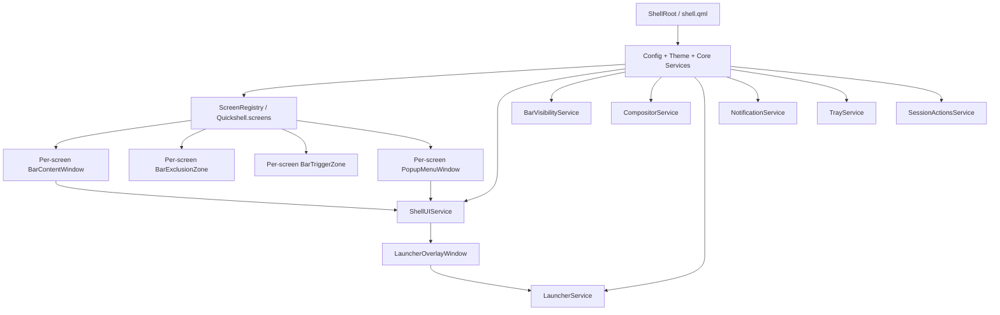
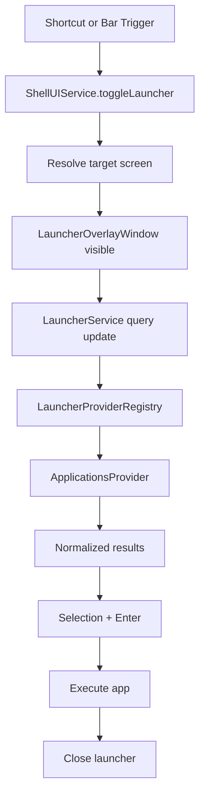

# Quickshell Desktop Environment Design

> **Status**: Draft
> **Source PRD**: `docs/Quickshell-Desktop-PRD.md`
> **Scope**: MVP design for the system bar, system tray, notification indicator, auto-hide trigger, session menu, and overlay application launcher.

---

## 1) Design Summary

This document translates the PRD into an implementable architecture for the first Quickshell shell release.

The MVP is intentionally narrow:

- one **top bar** per enabled monitor,
- one **overlay launcher** on the active screen,
- **system tray** support,
- **notification presence** in the bar,
- **auto-hide trigger zones**,
- and a **minimal power/session menu** in the bar.

The design optimizes for three things:

- **stable surface lifecycle**,
- **compositor-agnostic architecture**,
- and **clear ownership of UI state**.

### Why

The reference shells in `external` show that Quickshell is powerful, but complexity grows quickly when window types, focus rules, and compositor-specific behavior are mixed together.

### How

The MVP will:

- split shell responsibilities into a small number of dedicated surfaces,
- instantiate screen-bound surfaces per monitor,
- route compositor-specific behavior through a normalized adapter layer,
- keep popup and overlay coordination centralized,
- and expose future extension points without implementing the full ecosystem yet.

---

## 2) Resolved Design Decisions

These decisions are already fixed by the PRD and follow-up clarifications.

- **Tray in MVP**: included in the first release.
- **Notification widget in MVP**: included as a bar presence indicator, not a full notification center.
- **Auto-hide trigger in MVP**: included in the first release.
- **Session menu in MVP**: included as a minimal power/session actions menu in the bar.
- **Compositor strategy**: compositor-agnostic first; compositor-specific logic must live behind adapters.
- **Monitor layout policy**: the bar widget order stays the same across all monitors.
- **Launcher strategy**: overlay launcher only in the MVP.
- **Launcher evolution path**: future expansion should favor plugin-based productivity providers.

---

## 3) Design Goals

### Primary Goals

- Make the shell reliable enough for daily use.
- Keep the architecture small enough to understand and debug.
- Preserve a clean path for future modules.
- Avoid direct coupling between UI widgets and compositor-specific APIs.

### Design Constraints

- Target **Linux Wayland**.
- Support multi-monitor setups from the start.
- Keep the number of shell surfaces low.
- Prefer persistent surfaces over repeated create/destroy cycles.
- Make focus behavior explicit for every window.

### Non-Goals in This Design

- Notification history panel.
- Dock or task view.
- Lock screen.
- Wallpaper management.
- Desktop widgets.
- Per-monitor bar customization.
- Full launcher provider ecosystem.

---

## 4) Architecture Overview

At a high level, the shell will be composed from a root `shell.qml`, a set of singleton services, and a per-screen orchestration layer.



### Why

A split architecture keeps the bar, exclusion behavior, auto-hide reveal behavior, popup staging, and launcher lifecycle independent.

### How

Instead of one large all-purpose window, the shell uses a small set of focused surfaces with clear responsibilities.

---

## 5) Window Topology

The MVP should use the following window model.

| Surface | Count | Layer | Keyboard Focus | Exclusion | Responsibility |
|---|---:|---|---|---|---|
| `BarContentWindow` | per enabled screen | `Top` | `None` | `Ignore` | Renders the visible bar UI |
| `BarExclusionZone` | per enabled screen | `Top` | `None` | `Auto` or `Ignore` | Reserves layout space when the bar is visible and exclusive |
| `BarTriggerZone` | per enabled screen when needed | `Top` | `None` | `Ignore` | Thin invisible edge strip for auto-hide reveal |
| `PopupMenuWindow` | per enabled screen | `Top` by default | `None` or `OnDemand` | `Ignore` | Hosts tray menus, session menu, and future small popups |
| `LauncherOverlayWindow` | active on one screen | `Overlay` | `Exclusive` or adapter-managed | `Ignore` | Full-screen overlay launcher and dimmer |

### Why split the bar into multiple surfaces?

A single bar window is simpler on paper, but the split model is safer in practice.

- `BarExclusionZone` can remain stable even when the bar visuals animate or hide.
- `BarTriggerZone` can remain extremely lightweight.
- `PopupMenuWindow` can own click-outside behavior for tray and session menus without forcing the bar itself to manage complex popup rules.

### Monitor Stack

```text
Per enabled screen:

┌──────────────────────────────────────────────┐
│ BarExclusionZone   (Top, invisible reserve)  │
│ BarContentWindow   (Top, visible bar UI)     │
│ BarTriggerZone     (Top, 1px reveal strip)   │
│ PopupMenuWindow    (Top, fullscreen popup)   │
└──────────────────────────────────────────────┘

Global screen-targeted:

┌──────────────────────────────────────────────┐
│ LauncherOverlayWindow (Overlay, one screen)  │
└──────────────────────────────────────────────┘
```

---

## 6) Root Composition

The shell composition root should stay small.

### Proposed root responsibilities

- initialize configuration and theme singletons,
- initialize normalized services,
- enumerate enabled screens,
- create screen-aware shell surfaces,
- load the launcher overlay infrastructure,
- and avoid embedding business logic directly in `shell.qml`.

### Proposed root shape

```text
shell.qml
  - Config / Theme
  - Core Services
  - ScreenShells
  - LauncherOverlayHost
```

### Design Rule

`shell.qml` should compose modules, not own their detailed behavior.

---

## 7) Proposed File and Module Structure

The project should start from a structure that is small but future-safe.

```text
docs/
  Quickshell-Desktop-PRD.md
  Quickshell-Desktop-DESIGN.md

shell.qml

config/
  ShellConfig.qml
  Defaults.qml
  PersistentConfig.qml
  Theme.qml

types/
  ScreenContext.qml
  LauncherResult.qml
  WorkspaceState.qml
  WindowState.qml

modules/
  screens/
    ScreenShells.qml
    ScreenShellDelegate.qml

  bar/
    BarContentWindow.qml
    BarView.qml
    BarLayout.qml
    BarTriggerZone.qml
    widgets/
      LauncherButton.qml
      WorkspacesWidget.qml
      ActiveWindowWidget.qml
      ClockWidget.qml
      NetworkWidget.qml
      VolumeWidget.qml
      BatteryWidget.qml
      NotificationIndicatorWidget.qml
      TrayWidget.qml
      SessionMenuButton.qml

  popups/
    PopupMenuWindow.qml
    TrayMenu.qml
    SessionMenu.qml
    ConfirmActionDialog.qml

  launcher/
    LauncherOverlayWindow.qml
    LauncherView.qml
    LauncherResultsList.qml
    LauncherSearchField.qml

components/
  containers/
    ShellWindow.qml
  common/
    IconLabel.qml
    HoverArea.qml
    SelectionList.qml

services/
  ui/
    ShellUIService.qml
    BarVisibilityService.qml
    ScreenRegistryService.qml

  compositor/
    CompositorService.qml
    backends/
      HyprlandBackend.qml
      GenericBackend.qml

  launcher/
    LauncherService.qml
    LauncherProviderRegistry.qml
    providers/
      ApplicationsProvider.qml

  system/
    TrayService.qml
    NotificationService.qml
    SessionActionsService.qml
    AudioService.qml
    NetworkService.qml
    PowerService.qml
```

### Why

This layout separates:

- UI modules,
- stateful services,
- normalized types,
- and backend-specific integrations.

### How

The rule should be:

- UI modules depend on services and types,
- services may depend on backends,
- backends may depend on compositor-specific APIs,
- but UI modules should not depend directly on compositor-specific imports.

---

## 8) Screen Context Model

Every screen-aware module should receive an explicit `ScreenContext` object instead of passing raw `ShellScreen` values throughout the tree.

### Why

This keeps monitor-specific logic explicit and avoids hidden dependencies.

### How

`types/ScreenContext.qml` should expose normalized per-screen metadata:

- `screen`
- `name`
- `geometry`
- `scale`
- `barEdge`
- `barHeight`
- `isPrimary`

### Usage Rule

Any per-screen surface or widget should accept:

- `required property QtObject context`

or a strongly-typed equivalent.

That keeps modules consistent with the architecture direction already captured in `ARCHITECTURE-DRAFT.md`.

---

## 9) Service Responsibilities

## 9.1 `ScreenRegistryService`

### Why

The shell needs one place to decide which screens are active and to create stable `ScreenContext` objects.

### How

Responsibilities:

- wrap `Quickshell.screens`,
- filter excluded screens,
- create one `ScreenContext` per enabled screen,
- provide lookup by screen name,
- react to monitor hotplug and screen removal.

---

## 9.2 `ShellUIService`

### Why

Open/close behavior for overlays and popup surfaces becomes fragile if spread across widgets.

### How

Responsibilities:

- maintain the one-open-popup invariant,
- maintain launcher open state,
- resolve the target screen for launcher opening,
- register `PopupMenuWindow` instances by screen,
- close popups when overlays or screen changes require it,
- expose methods like:
  - `toggleLauncher(screen?)`
  - `closeLauncher()`
  - `openTrayMenu(screen, anchor, menu)`
  - `openSessionMenu(screen, anchor)`
  - `closeActivePopup(screen?)`

---

## 9.3 `BarVisibilityService`

### Why

Auto-hide behavior is stateful and screen-specific. It should not live inside individual widgets.

### How

Responsibilities:

- track per-screen bar visibility,
- track whether a screen trigger zone is hovered,
- track whether a popup is open on a screen,
- own show/hide delay timers,
- keep the bar visible while the user interacts with the bar or its popup,
- expose `effectiveVisible(screenName)`.

Suggested per-screen state:

- `displayMode`: `visible | auto_hide | non_exclusive`
- `hovered`
- `popupOpen`
- `forceVisible`
- `effectiveVisible`

---

## 9.4 `CompositorService`

### Why

Workspace state, active window metadata, focused screen, and fullscreen detection are compositor-sensitive.

### How

Responsibilities:

- provide a normalized interface for UI consumers,
- choose an adapter backend,
- isolate imports like `Quickshell.Hyprland` inside backend files only,
- degrade gracefully when a backend lacks a feature.

Normalized interface should expose at least:

- `focusedScreenName`
- `workspacesForScreen(screenName)`
- `activeWindowForScreen(screenName)`
- `screenHasFullscreen(screenName)`
- `switchWorkspace(screenName, workspaceId)`

### Backend Strategy

Start with:

- `HyprlandBackend.qml`
- `GenericBackend.qml`

`GenericBackend` may initially support only a reduced feature set, but the UI contract remains stable.

---

## 9.5 `TrayService`

### Why

The tray widget needs a stable facade over `Quickshell.Services.SystemTray` and popup behavior.

### How

Responsibilities:

- expose normalized tray items,
- support filtering hidden/passive items if configured,
- integrate with `ShellUIService` for tray menu opening,
- keep tray behavior independent from bar layout code.

The service may remain thin in the MVP, but it should still be the single bar-facing integration point.

---

## 9.6 `NotificationService`

### Why

The PRD includes a notification widget in the MVP, but not a full notification center.

### How

Responsibilities:

- observe incoming notifications,
- track unread presence and optional unread count,
- expose a minimal state model to the bar,
- preserve a store that can later power toasts or notification history.

### MVP Rule

The MVP widget only needs:

- unread presence,
- optional unread count,
- tooltip-friendly summary text,
- and a future-safe interface.

It does **not** need to implement a notification history panel in the first release.

---

## 9.7 `SessionActionsService`

### Why

Power and session commands are operationally sensitive and should not be embedded directly in the bar widget.

### How

Responsibilities:

- expose safe session actions:
  - lock
  - logout
  - reboot
  - shutdown
- read commands from config,
- support confirmation for destructive actions,
- centralize execution and failure logging.

### MVP Safety Rule

- `lock` may execute immediately.
- `logout`, `reboot`, and `shutdown` should require confirmation.

---

## 9.8 `LauncherService`

### Why

The launcher needs a state owner for query text, result calculation, selection state, and launch behavior.

### How

Responsibilities:

- own launcher query state,
- debounce search,
- ask the provider registry for results,
- manage selection index,
- execute selected results,
- request launcher close after successful launch.

---

## 9.9 `LauncherProviderRegistry`

### Why

The MVP only ships with application search, but the design must preserve a clean extension path for productivity providers.

### How

Responsibilities:

- register available providers,
- query active providers in priority order,
- merge and normalize results,
- keep the launcher UI independent from specific provider implementations.

### MVP Policy

Only `ApplicationsProvider` ships initially, but the registry exists in the MVP design.

---

## 9.10 Configuration Persistence

### Why

Configuration should survive Quickshell restarts, not just hot-reloads. Without persistence, user changes to `primaryScreen`, `barHeight`, `excludedScreens`, etc. are lost every time the shell process restarts.

### How

Use Quickshell's `FileView` + `JsonAdapter` to bind configuration properties to a JSON file on disk:

- `PersistentConfig.qml` — a `FileView` singleton that reads/writes `config.json` from `Quickshell.shellDir`
- `JsonAdapter` declares each configurable property with defaults from `Defaults.qml`
- `ShellConfig.qml` reads from `PersistentConfig.adapter.*` instead of directly from `Defaults`
- `Defaults.qml` remains the source of hardcoded default values (fallback when no persisted value exists)
- On first run, `onLoadFailed` writes defaults to disk so the file always exists after launch

### Config Layering

```text
Defaults.qml (hardcoded defaults)
    ↓
PersistentConfig.qml (disk-persisted overrides via FileView + JsonAdapter)
    ↓
ShellConfig.qml (read-only facade consumed by the rest of the shell)
```

### Persistence vs Reload

- **`PersistentProperties`** — survives hot-reload within the same process, but NOT across restarts
- **`FileView` + `JsonAdapter`** — disk-persistent, survives full process restart

Both mechanisms are available. `PersistentProperties` is appropriate for transient UI state (popup open/closed). `FileView` + `JsonAdapter` is appropriate for user configuration that must survive restarts.

---

## 10) Bar Design

The bar should have a fixed three-zone layout that stays the same on every monitor.

### Proposed Layout

- **Left**
  - launcher button
  - workspaces
  - active window title

- **Center**
  - clock/date

- **Right**
  - network
  - volume
  - battery
  - notification indicator
  - system tray
  - session menu button

### Why

A fixed layout reduces configuration complexity, avoids per-monitor drift, and keeps the MVP easy to reason about.

### How

- Widget ordering must be deterministic.
- If a widget has no useful data on a device, it can hide or collapse gracefully.
- Layout policy remains uniform across monitors even when content differs.

### Widget Notes

- **Notification indicator**: presence-only in the MVP.
- **Tray widget**: opens menu content inside `PopupMenuWindow`.
- **Session menu button**: opens a compact popup for session actions.

---

## 11) Popup and Menu Architecture

`PopupMenuWindow` should be the shared popup stage for tray and session actions.

### Why

This avoids embedding popup complexity inside the bar surface and makes outside-click behavior consistent.

### How

Each screen gets one `PopupMenuWindow`.

Responsibilities:

- render tray menu content,
- render session menu content,
- own click-outside dismissal,
- close on request from `ShellUIService`,
- support future small popups without changing the bar architecture.

### Design Rules

- Only one popup may be open per screen at a time.
- Opening a popup on one screen closes other popups if needed.
- Popup content must not manage global shell state directly.
- Any compositor-specific popup-layer workaround belongs in `CompositorService` or an adapter, not in bar widgets.

---

## 12) Auto-Hide Design

The MVP includes auto-hide reveal support, but the architecture should keep it minimal.

### Why

Auto-hide is useful, but it can become fragile if animation, visibility, exclusion, and hover behavior are coupled together.

### How

The design should separate concerns:

- `BarVisibilityService` owns visibility state,
- `BarTriggerZone` only reports edge hover,
- `BarContentWindow` renders based on state and manages `exclusiveZone` directly,

### Trigger Behavior

- `BarTriggerZone` is a thin invisible strip on the bar edge.
- It is active only when auto-hide mode is enabled and the bar is effectively hidden.
- Hovering it requests reveal through `BarVisibilityService`.

### Exclusion Behavior

- `BarContentWindow` uses `ExclusionMode.Auto` with a dynamic `exclusiveZone`.
- When the bar is persistently visible and exclusive, `exclusiveZone` equals `barHeight` (reserves space).
- When auto-hide is active and the bar is hidden, `exclusiveZone` is `0` (releases space).
- When `barDisplayMode` is `non_exclusive`, `exclusiveZone` is `0` (overlaps with app windows).

### Safety Rule

Auto-hide must not require special fullscreen hacks. The bar should remain compositor-safe even if fullscreen windows naturally occlude top-layer content.

---

## 13) Launcher Design

The launcher is overlay-only in the MVP.

### Why

Overlay mode is simpler than supporting both bar-attached and overlay modes. It also avoids geometry coupling between bar layout and launcher placement.

### How

Each screen may have a `LauncherOverlayWindow` instance, but only the active screen instance should be visible.

Responsibilities:

- dim the background,
- host the launcher panel,
- capture keyboard focus while open,
- close on explicit dismissal,
- hand search state to `LauncherService`.

### MVP Presentation

- centered panel
- dimmed backdrop
- search field
- result list
- default selected result

### Search Flow



---

## 14) Launcher Provider Interface

The future provider system should be designed now, even if only one provider ships initially.

### Why

This avoids rewriting launcher internals when productivity providers are added later.

### How

Each provider should expose a normalized contract such as:

- `id`
- `label`
- `enabled`
- `priority`
- `supportsQuery(query)`
- `search(query, limit)`
- `activate(result)`

Each result should normalize to a `LauncherResult` type:

- `id`
- `providerId`
- `title`
- `subtitle`
- `icon`
- `kind`
- `actions`
- `payload`

### MVP Provider

`ApplicationsProvider` should:

- read desktop entries,
- deduplicate results where needed,
- search by name, comment, and executable name,
- return icon + label presentation data,
- and support direct execution.

### Deferred Providers

Later providers may include:

- calculator,
- clipboard,
- emoji,
- commands,
- web search,
- or project-specific productivity plugins.

---

## 15) Compositor Abstraction Boundaries

Compositor-specific logic must be isolated from UI modules.

### Rule

UI files under `modules/` should not directly import compositor-specific namespaces when a normalized service can provide the same information.

### Allowed Backend Dependency Area

Only backend files under `services/compositor/backends/` should directly depend on compositor-specific APIs.

### Examples

- `WorkspacesWidget.qml` reads from `CompositorService`, not `Hyprland` directly.
- `ActiveWindowWidget.qml` reads normalized active-window state.
- `BarContentWindow.qml` uses `CompositorService.screenHasFullscreen(screenName)`.
- `ShellUIService` asks `CompositorService` to resolve the most relevant active screen.

### Benefit

This keeps the MVP implementable on Hyprland first if needed, while preserving a clean path to additional compositor backends.

---

## 16) Data Flow and Ownership

### Boot Flow

1. `shell.qml` loads config and services.
2. `ScreenRegistryService` produces enabled `ScreenContext` instances.
3. `ScreenShells.qml` creates per-screen bar, exclusion, trigger, and popup windows.
4. `ShellUIService` registers per-screen popup windows.
5. `LauncherOverlayWindow` remains dormant until requested.

### Tray Flow

1. User clicks a tray item.
2. `TrayWidget` delegates to `TrayService` and `ShellUIService`.
3. `ShellUIService` resolves the screen’s `PopupMenuWindow`.
4. `PopupMenuWindow` renders the tray menu.
5. Click outside closes the popup.

### Session Menu Flow

1. User clicks the session menu button.
2. `ShellUIService` opens `SessionMenu` inside the screen popup window.
3. Selecting a destructive action opens confirmation.
4. `SessionActionsService` executes the confirmed command.

### Notification Flow

1. `NotificationService` observes incoming notifications.
2. Service updates unread presence/count state.
3. `NotificationIndicatorWidget` updates in the bar.
4. Future notification history or toasts can reuse the same store.

---

## 17) Error Handling and Fallbacks

### Compositor Backend Missing Features

If a compositor backend cannot provide workspaces or active window metadata:

- the bar still renders,
- affected widgets degrade gracefully,
- and the shell continues operating.

### Desktop Entries Unavailable

If application lookup fails:

- the launcher opens,
- shows an empty or error state,
- and does not crash the shell.

### Tray Unavailable

If system tray integration is not available:

- the tray widget hides or shows an empty state,
- and the bar layout remains stable.

### Screen Removal / Hotplug

If a screen disappears:

- close any popup or launcher targeting that screen,
- destroy the screen’s surfaces,
- and recreate stable context for the remaining screens.

### Session Action Failure

If a command fails:

- log the error clearly,
- close the confirmation state safely,
- and avoid crashing or wedging shell UI state.

---

## 18) Implementation Plan

The implementation should follow the PRD’s MVP-first sequence, with a slightly more concrete engineering breakdown.

### Phase 1: Core Foundation

- create `shell.qml`
- create `ShellConfig`, `Theme`, and `ScreenContext`
- create `ScreenRegistryService`
- create `ShellUIService`
- create `CompositorService` and adapter shape
- create shared `ShellWindow` base container

### Phase 2: Bar Surface Stack

- implement `ScreenShells.qml`
- implement `BarContentWindow`
- implement `BarExclusionZone`
- implement `BarTriggerZone`
- implement `BarVisibilityService`
- validate hotplug and fullscreen behavior

### Phase 3: Bar Widgets and Popup Stage

- implement bar layout and widget order
- implement workspace, active window, clock, network, volume, battery widgets
- implement `PopupMenuWindow`
- implement `TrayService` + tray widget + tray menu
- implement `NotificationService` + notification indicator widget
- implement `SessionActionsService` + session menu + confirmation dialog

### Phase 4: Launcher MVP

- implement `LauncherOverlayWindow`
- implement `LauncherService`
- implement `LauncherProviderRegistry`
- implement `ApplicationsProvider`
- wire global shortcut and bar trigger
- validate keyboard navigation and launch flow

### Phase 5: Hardening

- refine focus and dismissal behavior
- validate multi-monitor edge cases
- validate adapter fallback behavior
- improve styling and motion
- document implementation decisions

---

## 19) Verification Strategy

The design should be validated with a small, explicit manual verification matrix.

### Single Monitor

- bar renders correctly
- launcher opens and closes correctly
- tray menu opens and dismisses correctly
- session menu confirms destructive actions
- auto-hide trigger reveals the bar correctly

### Multi-Monitor

- bar layout is identical across monitors
- launcher opens on the intended screen
- popup windows stay screen-local
- screen removal closes related windows safely

### Compositor Abstraction

- shell still runs when advanced backend data is missing
- workspace/active-window widgets degrade without crashing
- backend-specific code remains isolated to backend files

### Stability

- repeated launcher open/close cycles do not leak state
- repeated tray popup open/close cycles do not wedge input
- shell reload and hotplug do not leave orphaned popups or overlays

---

## 20) Recommended Next Step

After this design doc, the next artifact should be a concrete implementation plan with:

- exact file creation order,
- service APIs,
- normalized type definitions,
- backend adapter contracts,
- and a milestone-by-milestone execution checklist.

That plan should implement this core rule:

**build the smallest stable shell surface set first, and keep compositor-specific logic out of feature widgets.**
