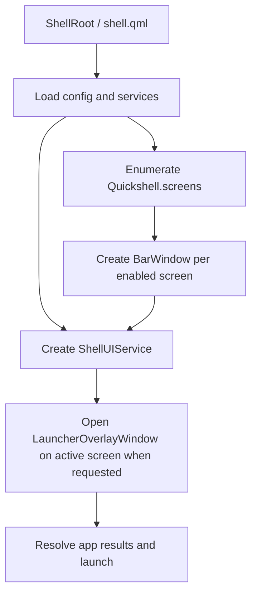

# Quickshell Desktop Environment PRD

> **Status**: Draft
> **Product Direction**: Hybrid, but MVP-first
> **Primary Goal**: Build a daily-drivable Quickshell desktop shell with a reliable system bar and a fast application launcher.

---

## 1) Product Summary

Build a Quickshell-based desktop environment layer for Linux Wayland sessions that feels cohesive enough for daily use, while staying small enough to evolve safely.

The first release should focus on two core capabilities:

- A **system bar** that gives the user stable, always-available desktop status and navigation.
- An **application launcher** that provides fast, keyboard-first application discovery and launching.

This is not intended to be a full clone of existing shells on day one. The MVP should establish a solid shell foundation, a clean architecture, and a clear interaction model that can later expand into notifications, control center, dock, lock screen, widgets, wallpaper tooling, and richer panel ecosystems.

### Why

- Existing reference shells in `external` show that Quickshell can support sophisticated desktop UX, but they also demonstrate how quickly complexity grows.
- A focused MVP reduces surface area, avoids premature plugin systems, and helps validate the core architecture before more modules are added.
- The bar and launcher together cover the most important shell workflows: orientation, status, navigation, and app access.

### How

- Start with a **small number of explicit shell windows**.
- Use **per-screen instantiation** as the default model.
- Keep **input, focus, and layering policies explicit**.
- Centralize shell UI state in a dedicated coordinator service.
- Make the MVP opinionated first, but avoid decisions that block future extensibility.

---

## 2) Product Direction and Assumptions

### Product Direction

The initial product direction is:

- **Personal-use MVP first**
- **Architecture clean enough for later reuse**
- **Configurability added gradually, not all at once**

### Working Assumptions

- The shell targets **Linux Wayland** sessions.
- The first implementation should prioritize **compositor-agnostic architecture**, using compositor-specific behavior only when unavoidable and isolating it behind clear abstractions.
- The first milestone should prioritize **stability, clarity, and iteration speed** over feature breadth.
- The launcher will ship first as an **overlay launcher**, not as multiple launcher modes.
- The bar will ship first as a **top-position system bar** with a system tray, notification presence, auto-hide trigger support, and a minimal session/power menu, while positional flexibility remains deferred.

### Open Assumptions to Validate Later

- No MVP-blocking product assumptions currently remain. Remaining details are implementation-level.

---

## 3) Problem Statement

Current Linux desktop shell options are either:

- too heavyweight,
- too opinionated for the desired workflow,
- too fragmented across multiple tools,
- or not designed around Quickshell as the primary UI runtime.

The goal is to create a shell that:

- feels native to a Quickshell/QML workflow,
- supports multi-monitor desktop usage cleanly,
- remains understandable to maintain,
- and can become the foundation for a broader desktop environment over time.

---

## 4) Goals and Non-Goals

### Goals

- Deliver a stable **system bar** for daily use.
- Deliver a fast **application launcher** with keyboard-first interaction.
- Support **multi-monitor setups** using Quickshell-native screen iteration patterns.
- Prioritize **compositor-agnostic** shell behavior and abstractions from the first release.
- Establish clear shell architecture for future modules.
- Keep the MVP small enough to implement, debug, and iterate quickly.

### Non-Goals for the First MVP

- Full lock screen implementation.
- Notification center or notification history.
- Desktop widgets.
- Dock or task view.
- Wallpaper management.
- Full control center/settings panels.
- Rich plugin marketplace or generalized plugin runtime.
- Advanced launcher providers like clipboard, calculator, emoji, commands, or web search.

---

## 5) Target Users

### Primary User

A Linux power user building and iterating on a custom Wayland shell for their own workstation.

### Secondary User

Future contributors or advanced users who may want to install, study, or adapt the shell later.

### User Needs

- Quick access to apps.
- Immediate visibility into desktop state.
- Predictable interaction behavior.
- Multi-monitor awareness.
- A shell that does not feel fragile during normal use.

---

## 6) User Value Proposition

The product should let the user:

- launch apps faster than opening a terminal or external launcher,
- understand system state at a glance,
- navigate workspaces and active windows quickly,
- and rely on a shell that remains visually coherent and technically understandable.

In short: **a focused Quickshell shell that is pleasant to live in and realistic to maintain**.

---

## 7) UX Principles

### 1. Keyboard-first, mouse-friendly

The launcher should feel excellent from the keyboard, while the bar remains easy to use with pointer interactions.

### 2. Small number of clear surfaces

The UI should avoid spawning ad-hoc windows for every interaction. Shell surfaces should be intentional and predictable.

### 3. Stable before clever

The MVP should prefer obvious, debuggable behavior over fancy transitions or highly dynamic layouts.

### 4. Multi-monitor by default

If the shell behaves differently on multiple screens, that behavior must be deliberate and documented.

### 5. Compositor-safe behavior

Window churn, focus stealing, and layer misuse should be minimized.

---

## 8) MVP Scope

### In Scope

- One **top system bar per enabled monitor**.
- One **overlay application launcher** that opens on the active/focused screen.
- A central shell service for panel/open state and cross-screen coordination.
- Basic shell configuration for enabling screens and adjusting a small set of visual/behavior options.
- Reliable keyboard focus and close behavior.
- System tray integration, notification presence in the bar, auto-hide trigger behavior, and a minimal session/power menu in the bar.
- Uniform bar layout across all enabled monitors.

### Out of Scope

- Dock/taskbar beyond workspace and active-window presentation.
- Nested dashboard panels.
- Popup-heavy control center architecture.
- Separate settings application.
- Full launcher provider ecosystem beyond the applications provider MVP.
- Per-monitor bar layout differences or widget ordering.

---

## 9) Feature Requirements

## 9.1 System Bar

### Why

The system bar is the user’s primary orientation surface. It anchors the shell visually and functionally by exposing navigation, state, and entry points into other shell actions.

### How

The MVP bar should be a dedicated per-screen surface using a `Top` layer strategy with explicit exclusion behavior. It should remain simple, predictable, and easy to reason about.

### Functional Requirements

- **BAR-001**: The system shall render one bar per enabled monitor.
- **BAR-002**: The system shall reserve screen space for the bar using Wayland layer-shell exclusion behavior.
- **BAR-003**: The bar shall be mounted from a screen-aware root pattern based on `Quickshell.screens`.
- **BAR-004**: The bar shall include a **launcher trigger**.
- **BAR-005**: The bar shall display **workspace state**.
- **BAR-006**: The bar shall display the **active window title** or equivalent focused-client summary.
- **BAR-007**: The bar shall display **clock/date** information.
- **BAR-008**: The bar shall display essential **system status** indicators, at minimum:
  - network state
  - audio state
  - battery state when battery hardware is available
- **BAR-009**: The bar shall provide a **system tray** for compatible tray items.
- **BAR-010**: The bar shall provide a **notification presence indicator** at minimum, with room to evolve into richer notification UX later.
- **BAR-011**: The bar shall support an **auto-hide trigger zone** so hidden bars can be revealed predictably.
- **BAR-012**: The bar shall include a minimal **session/power menu** supporting at least lock, logout, reboot, and shutdown.
- **BAR-013**: The bar shall support pointer interaction for clickable widgets.
- **BAR-014**: The bar shall not require keyboard focus during idle operation.
- **BAR-015**: The bar shall behave safely when fullscreen windows are present.
- **BAR-016**: The bar shall remain usable across monitor hotplug and shell reload scenarios.
- **BAR-017**: The bar shall use the same widget layout and ordering across all monitors in the MVP.

### MVP Widget Set

Recommended initial widget set:

- launcher button
- workspaces
- active window title
- clock/date
- network indicator
- volume indicator
- battery indicator
- system tray
- notification indicator
- auto-hide trigger zone
- session menu button

### Deferred Bar Features

- media widget
- weather
- notification history panel
- per-monitor custom widget composition or different bar layouts
- multiple bar edges or framed bars

### Acceptance Criteria

- Bar appears on every enabled monitor after shell startup.
- Workspace state updates correctly when switching workspaces.
- Active window text updates when focus changes.
- Launcher can be opened from the bar.
- Tray items render and remain interactable in the bar.
- Notification presence is visible from the bar.
- Auto-hide reveal behavior works predictably via the trigger zone.
- Session menu opens from the bar and destructive actions require confirmation.
- Bar layout and widget ordering remain consistent across all monitors.
- Fullscreen applications are not broken by the bar’s layer/exclusion strategy.

---

## 9.2 Application Launcher

### Why

The launcher is the fastest path from intent to action. It is the second foundational shell capability after the bar and should become the shell’s main keyboard entry point.

### How

The MVP launcher should ship as a single **overlay launcher window**. This keeps the first implementation simple, works well with dimming/backdrop interactions, and avoids mixing launcher state with bar geometry too early.

### Functional Requirements

- **LAUNCH-001**: The launcher shall open via a global shortcut.
- **LAUNCH-002**: The launcher shall also open via a bar trigger.
- **LAUNCH-003**: The launcher shall open on the currently focused or most relevant screen.
- **LAUNCH-004**: The launcher shall search installed applications from desktop entries.
- **LAUNCH-005**: Search shall match at least:
  - app name
  - app comment/description where available
  - executable name where available
- **LAUNCH-006**: The launcher shall support keyboard navigation:
  - typing to filter
  - arrow keys to move selection
  - `Enter` to launch
  - `Escape` to close
- **LAUNCH-007**: The launcher shall close on explicit dismissal, including outside click or focus-clearing behavior.
- **LAUNCH-008**: Launching an app shall close the launcher cleanly.
- **LAUNCH-009**: The launcher shall support icon + label presentation for results.
- **LAUNCH-010**: The launcher shall remain responsive on typical desktop app lists.

### Recommended MVP Presentation

- centered overlay panel
- dimmed backdrop
- search field at top
- vertically scrollable result list
- highlighted default selection
- icon, app name, and optional description per row

### Deferred Launcher Features

- clipboard history
- calculator results
- emoji picker
- shell command execution
- web search fallback
- recent apps
- favorites/pinned apps
- plugin-based productivity provider framework
- preview side panel
- grid mode
- category browsing

### Acceptance Criteria

- Launcher opens reliably from both shortcut and bar.
- Typing filters app results without noticeable lag.
- `Enter` launches the selected app.
- Clicking outside closes the launcher.
- The launcher opens on the intended screen in a multi-monitor setup.

---

## 10) Non-Functional Requirements

- **NFR-001**: The shell must favor stable layer-shell behavior over aggressive visual complexity.
- **NFR-002**: Launcher open latency should feel immediate on target hardware.
- **NFR-003**: Search updates should remain smooth on a typical installed application set.
- **NFR-004**: The shell should survive configuration reloads and normal restarts without orphaned surfaces.
- **NFR-005**: Window namespaces should be explicit and stable for debugging.
- **NFR-006**: Focus policies must be explicit for each shell surface.
- **NFR-007**: The architecture should support later modules without requiring a full rewrite of the bar/launcher foundation.

---

## 11) Recommended Architecture Direction

### Why

The example projects in `external` show a consistent lesson: successful Quickshell shells treat screens, surfaces, focus, and shared UI state as first-class architecture concerns.

### How

The MVP should adopt a compact version of that pattern:

- `shell.qml` as the composition root
- a screen-aware instantiation layer
- a dedicated service for shell open/close state
- distinct shell windows for bar and launcher

### Proposed Window Model

Per enabled screen:

- **BarWindow**
  - layer: `Top`
  - keyboard focus: `None`
  - exclusion: enabled

Global or screen-targeted:

- **LauncherOverlayWindow**
  - active only on the chosen screen
  - layer: `Overlay`
  - keyboard focus: exclusive or explicitly managed while open
  - exclusion: ignored

### Proposed Coordination Service

A singleton service should manage:

- active screen resolution for launcher opening
- one-open-overlay invariant
- panel/overlay close behavior
- screen registration for future popup surfaces
- shell-wide visibility state

Suggested name:

- `ShellUIService`
- or `PanelService` if the repo continues using panel terminology

### Proposed Initialization Flow

### Key Technical Decisions for MVP

- Use **per-screen `Variants`** or equivalent screen iteration for the bar.
- Keep the launcher in **overlay mode only** for the first release.
- Keep window layering explicit and conservative.
- Avoid creating/destroying surfaces repeatedly during normal interactions when a persistent hidden surface is safer.
- Use stable namespaces for each surface type.
- Prioritize compositor-neutral abstractions and isolate compositor-specific logic behind services or adapters.
- Keep the bar layout uniform across monitors in the first release.
- Leave a clear extension point for future plugin-based productivity providers in the launcher.

---

## 12) Reference Design Inputs from `external`

### Caelestia

Useful patterns:

- screen-aware module composition from `shell.qml`
- one-window-per-screen via `Variants`
- explicit layer and keyboard-focus policies
- config-driven launcher actions and shell behavior

Takeaway:

- Good reference for **layer/focus discipline** and **screen-aware shell composition**.

### Noctalia

Useful patterns:

- separation of bar content, exclusion zones, and popup windows
- overlay launcher mode with dedicated service state
- explicit one-open-panel coordination
- per-screen orchestration through an `AllScreens` layer

Takeaway:

- Strong reference for **MVP shell architecture**, especially **screen orchestration** and **overlay launcher behavior**.

### end4

Useful patterns:

- keyboard-first overview/search workflow
- launcher search behavior using desktop entries and multiple result types
- adaptive bar density and highly interactive bar regions

Takeaway:

- Strong reference for **launcher interaction design** and **keyboard-centric workflows**.

---

## 13) Scope Decisions for the First Build

### Included Now

- top bar only, with tray, notification presence, auto-hide trigger support, and a minimal session/power menu
- overlay launcher only
- applications provider only, with a future path toward plugin-based productivity providers
- simple config surface
- multi-monitor awareness with a uniform bar layout across monitors

### Deferred Intentionally

- generalized popup menu architecture beyond what tray support requires
- plugin-based productivity providers beyond the applications provider MVP
- overview/dashboard fusion
- dock
- notification history and richer notification UX
- lock screen
- settings panels

This keeps the MVP narrow while preserving architectural room for later growth.

---

## 14) Success Metrics

The MVP will be considered successful if:

- the shell can be used daily for app launching and desktop orientation,
- the bar is stable across normal session usage,
- launcher interaction feels immediate and reliable,
- multi-monitor behavior is predictable,
- and future features can be added without replacing the foundation.

Suggested concrete evaluation points:

- User can launch common apps in a few keystrokes.
- Bar and launcher remain functional after repeated open/close cycles.
- No major focus trap or stuck-overlay issues appear in normal use.
- No recurring compositor instability is introduced by shell surfaces.

---

## 15) Milestones

### Milestone 1: Foundation

- establish shell root
- load config and shared services
- enumerate screens cleanly
- create base window abstractions

### Milestone 2: System Bar MVP

- render bar per monitor
- wire workspace, active window, clock, and status widgets
- validate exclusion and fullscreen behavior

### Milestone 3: Launcher MVP

- implement overlay launcher window
- wire desktop-entry search
- add keyboard navigation and launch behavior
- integrate bar trigger + shortcut trigger

### Milestone 4: Polish and Hardening

- improve styling and motion
- handle edge cases around monitor changes and reloads
- refine focus and dismissal behavior
- document architecture and implementation decisions

---

## 16) Risks

- **Focus complexity**: overlay surfaces can easily create stuck-focus or dismissal issues.
- **Layer misuse**: wrong layer choices can break fullscreen behavior or input handling.
- **Surface churn**: aggressive create/destroy cycles can destabilize compositors.
- **Premature scope growth**: richer notification UX, widgets, settings, and provider ecosystems can quickly overwhelm the MVP.
- **Compositor coupling**: compositor-specific behavior can leak into the initial architecture if it is not isolated early.

### Mitigation Strategy

- keep the number of shell surfaces low,
- centralize open/close state,
- define focus behavior explicitly,
- isolate compositor-specific logic behind clear service or adapter boundaries,
- and defer nonessential modules until the bar + launcher path is solid.

---

## 17) Resolved Product Decisions

- **System tray in first release**: Yes. The first release includes system tray support as part of the MVP bar.
- **Session menu in first release**: Yes. The first release includes a minimal session/power menu in the bar.
- **Compositor strategy**: Prioritize compositor-agnostic architecture and behavior from the first implementation.
- **Bar layout across monitors**: No per-monitor layout differences in the MVP. The bar layout and widget order stay the same on all monitors.
- **Launcher evolution direction**: Favor plugin-based productivity providers as the next launcher expansion path.

---

## 18) Recommended Next Step

After this PRD, the next engineering artifact should be a concrete architecture and implementation plan that defines:

- file/module boundaries,
- service interfaces,
- compositor abstraction boundaries,
- screen context model,
- window types,
- launcher provider extension points,
- and milestone-by-milestone implementation order.

The implementation plan should stay aligned with this PRD’s core rule:

**ship the bar and launcher first, and make them stable before expanding the shell.**
